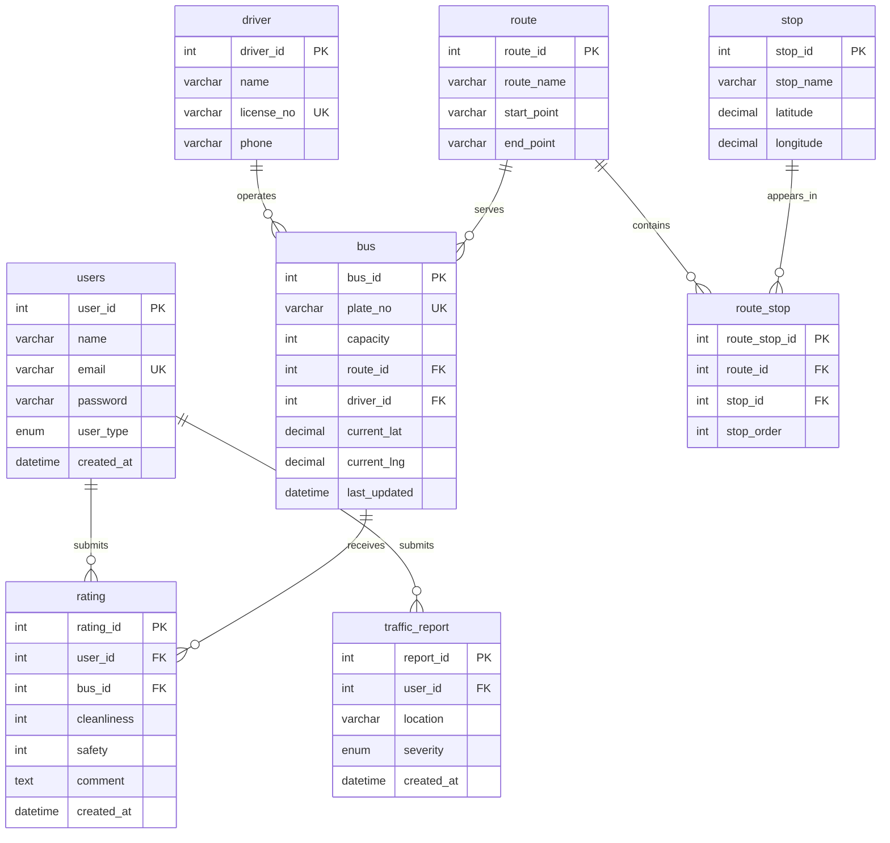

# GoSmart — Database Design

Relational data model for the GoSmart real-time bus tracking platform (Kimironko corridor, Kigali).

This folder is the **reference MySQL schema** from the project proposal. The Django backend in `GoSmart_Backend/` implements the same domain with a slightly evolved shape (see [Backend mapping](#backend-mapping) below).

## Files

| File | Purpose |
|---|---|
| `schema.sql` | Full DDL: tables, FKs, indexes, views, and demo seed data |
| `seed.sql` | Standalone seed inserts (use after DDL only) |
| `queries.sql` | Example SELECT queries for API and reporting |

## Entity–relationship overview



## Design decisions

### Normalization

- **Route ↔ Stop** is a many-to-many relationship resolved through `route_stop`, with `stop_order` capturing sequence along the corridor.
- **Driver** is a separate entity in this reference schema; buses reference drivers optionally (`ON DELETE SET NULL`).
- **Ratings** and **traffic reports** hang off `users` with `ON DELETE CASCADE` so orphaned feedback rows are never left behind.

### Referential integrity

| Child table | Parent | On delete |
|---|---|---|
| `route_stop` | `route`, `stop` | CASCADE |
| `bus` | `route`, `driver` | SET NULL |
| `rating` | `users`, `bus` | CASCADE |
| `traffic_report` | `users` | CASCADE |

`SET NULL` on bus assignments keeps historical fleet records when a route or driver is removed. `CASCADE` on junction and feedback tables avoids dangling links.

### Indexes

Secondary indexes target the query paths the API uses most:

- `bus.last_updated` — live map polling and staleness checks
- FK columns on `bus`, `route_stop`, `rating`, `traffic_report` — join and filter performance
- `rating.created_at`, `traffic_report.created_at` — recent-activity listings

### Views

| View | Replaces |
|---|---|
| `v_live_buses` | Live fleet query for the map dashboard |
| `v_route_stops_ordered` | Ordered stop list per route (parameterize with `WHERE route_id = ?`) |

## Setup

Create the database and load the schema:

```bash
mysql -u root -p -e "CREATE DATABASE IF NOT EXISTS gosmart CHARACTER SET utf8mb4 COLLATE utf8mb4_unicode_ci;"
mysql -u root -p gosmart < database/schema.sql
```

To reload seed data only (empty tables assumed):

```bash
mysql -u root -p gosmart < database/seed.sql
```

## Backend mapping

The Django ORM in `GoSmart_Backend/gosmart/` covers the same features with these differences:

| Reference schema | Django implementation | Notes |
|---|---|---|
| `users` + `driver` | `accounts.User` | Single table with `role` (`passenger`, `driver`, `admin`); driver fields live on the same model |
| `users.user_type` | `User.role` | Backend uses operational roles, not commuter/newcomer/visitor |
| `driver` table | — | Merged into `User` when `role='driver'` |
| `bus.driver_id → driver` | `Bus.driver → User` | FK targets auth user, limited to drivers |
| `traffic_report` | `community.TrafficReport` | Adds `reviewed` flag for admin moderation |
| Table names | Django default (`app_model`) | Migrations manage production SQLite/MySQL |

The reference schema remains the canonical **proposal document**; the backend is the **running implementation**. Both models share the same core entities: routes, stops, ordered route stops, buses with GPS, ratings, and traffic reports.

## Maintainer

**Mizero Eloi** — Database Designer
